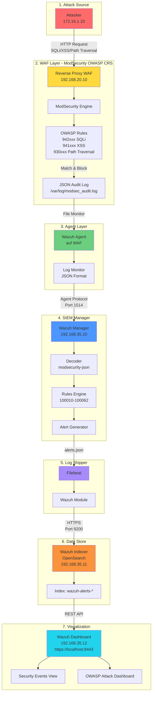
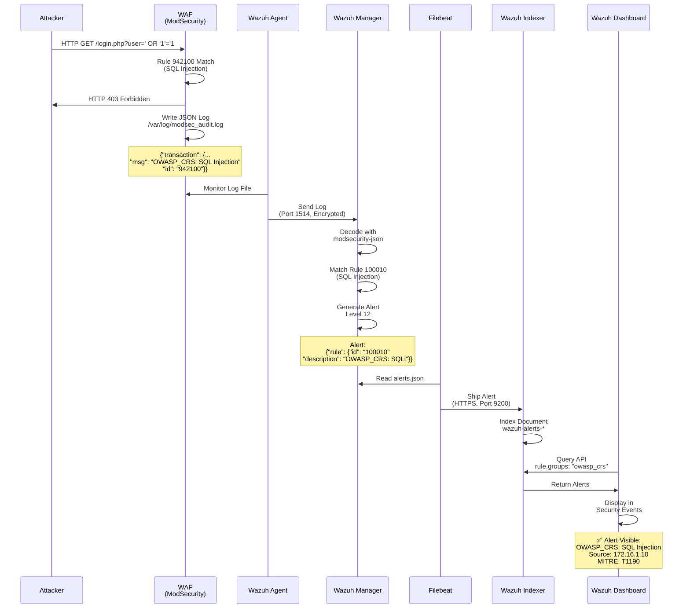
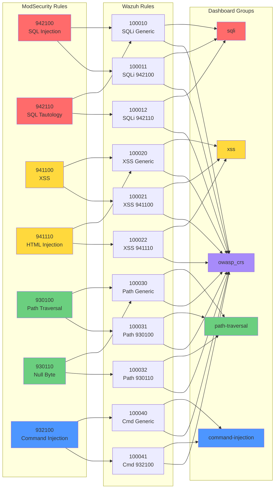
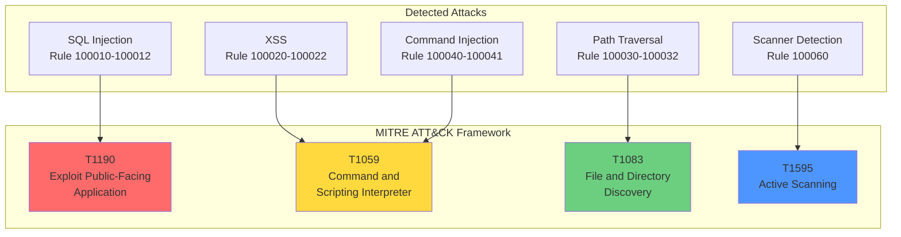
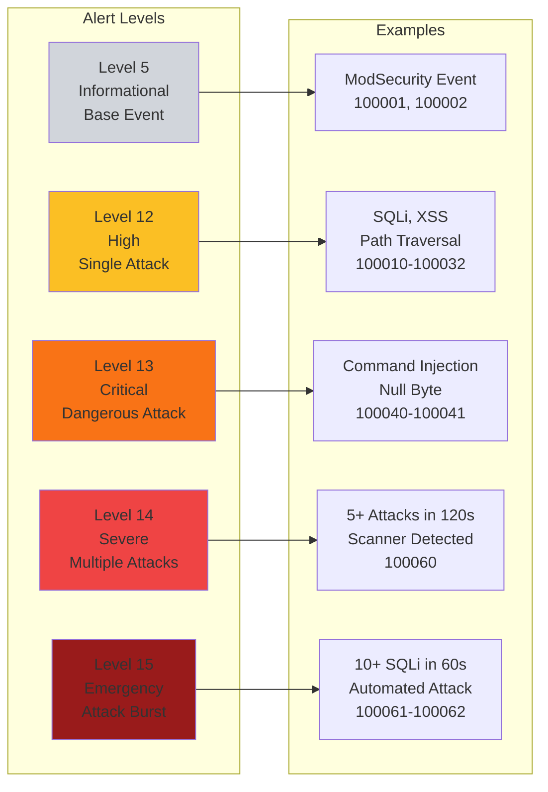

# OWASP Attack Detection - Pipeline Visualisierung

## Datenfluss-Diagramm

```mermaid
graph TB
    subgraph "1. Attack Source"
        A[Attacker<br/>172.16.1.10]
    end
    
    subgraph "2. WAF Layer - ModSecurity OWASP CRS"
        B[Reverse Proxy WAF<br/>192.168.20.10]
        B1[ModSecurity Engine]
        B2[OWASP Rules<br/>942xxx SQLi<br/>941xxx XSS<br/>930xxx Path Traversal]
        B3[JSON Audit Log<br/>/var/log/modsec_audit.log]
    end
    
    subgraph "3. Agent Layer"
        C[Wazuh Agent<br/>auf WAF]
        C1[Log Monitor<br/>JSON Format]
    end
    
    subgraph "4. SIEM Manager"
        D[Wazuh Manager<br/>192.168.35.10]
        D1[Decoder<br/>modsecurity-json]
        D2[Rules Engine<br/>100010-100062]
        D3[Alert Generator]
    end
    
    subgraph "5. Log Shipper"
        E[Filebeat]
        E1[Wazuh Module]
    end
    
    subgraph "6. Data Store"
        F[Wazuh Indexer<br/>OpenSearch<br/>192.168.35.11]
        F1[Index: wazuh-alerts-*]
    end
    
    subgraph "7. Visualization"
        G[Wazuh Dashboard<br/>192.168.35.12<br/>https://localhost:8443]
        G1[Security Events View]
        G2[OWASP Attack Dashboard]
    end
    
    A -->|HTTP Request<br/>SQLi/XSS/Path Traversal| B
    B --> B1
    B1 --> B2
    B2 -->|Match & Block| B3
    B3 -->|File Monitor| C
    C --> C1
    C1 -->|Agent Protocol<br/>Port 1514| D
    D --> D1
    D1 --> D2
    D2 --> D3
    D3 -->|alerts.json| E
    E --> E1
    E1 -->|HTTPS<br/>Port 9200| F
    F --> F1
    F1 -->|REST API| G
    G --> G1
    G --> G2
    
    style A fill:#ff6b6b
    style B fill:#ffd93d
    style C fill:#6bcf7f
    style D fill:#4d96ff
    style E fill:#a78bfa
    style F fill:#fb923c
    style G fill:#22d3ee
```

## Attack Detection Flow

```mermaid
sequenceDiagram
    participant Attacker
    participant WAF as WAF<br/>(ModSecurity)
    participant Agent as Wazuh Agent
    participant Manager as Wazuh Manager
    participant Filebeat
    participant Indexer as Wazuh Indexer
    participant Dashboard as Wazuh Dashboard
    
    Attacker->>WAF: HTTP GET /login.php?user=' OR '1'='1
    
    WAF->>WAF: Rule 942100 Match<br/>(SQL Injection)
    WAF->>Attacker: HTTP 403 Forbidden
    WAF->>WAF: Write JSON Log<br/>/var/log/modsec_audit.log
    
    Note over WAF: {"transaction": {...<br/>"msg": "OWASP_CRS: SQL Injection"<br/>"id": "942100"}}
    
    Agent->>WAF: Monitor Log File
    Agent->>Manager: Send Log<br/>(Port 1514, Encrypted)
    
    Manager->>Manager: Decode with<br/>modsecurity-json
    Manager->>Manager: Match Rule 100010<br/>(SQL Injection)
    Manager->>Manager: Generate Alert<br/>Level 12
    
    Note over Manager: Alert:<br/>{"rule": {"id": "100010"<br/>"description": "OWASP_CRS: SQLi"}}
    
    Filebeat->>Manager: Read alerts.json
    Filebeat->>Indexer: Ship Alert<br/>(HTTPS, Port 9200)
    
    Indexer->>Indexer: Index Document<br/>wazuh-alerts-*
    
    Dashboard->>Indexer: Query API<br/>rule.groups: "owasp_crs"
    Indexer->>Dashboard: Return Alerts
    
    Dashboard->>Dashboard: Display in<br/>Security Events
    
    Note over Dashboard: ✅ Alert Visible:<br/>OWASP_CRS: SQL Injection<br/>Source: 172.16.1.10<br/>MITRE: T1190
```

## Rule Mapping

```mermaid
graph LR
    subgraph "ModSecurity Rules"
        M1[942100<br/>SQL Injection]
        M2[942110<br/>SQL Tautology]
        M3[941100<br/>XSS]
        M4[941110<br/>HTML Injection]
        M5[930100<br/>Path Traversal]
        M6[930110<br/>Null Byte]
        M7[932100<br/>Command Injection]
    end
    
    subgraph "Wazuh Rules"
        W1[100010<br/>SQLi Generic]
        W2[100011<br/>SQLi 942100]
        W3[100012<br/>SQLi 942110]
        W4[100020<br/>XSS Generic]
        W5[100021<br/>XSS 941100]
        W6[100022<br/>XSS 941110]
        W7[100030<br/>Path Generic]
        W8[100031<br/>Path 930100]
        W9[100032<br/>Path 930110]
        W10[100040<br/>Cmd Generic]
        W11[100041<br/>Cmd 932100]
    end
    
    subgraph "Dashboard Groups"
        D1[sqli]
        D2[xss]
        D3[path-traversal]
        D4[command-injection]
        D5[owasp_crs]
    end
    
    M1 --> W1
    M1 --> W2
    M2 --> W1
    M2 --> W3
    M3 --> W4
    M3 --> W5
    M4 --> W4
    M4 --> W6
    M5 --> W7
    M5 --> W8
    M6 --> W7
    M6 --> W9
    M7 --> W10
    M7 --> W11
    
    W1 --> D1
    W2 --> D1
    W3 --> D1
    W4 --> D2
    W5 --> D2
    W6 --> D2
    W7 --> D3
    W8 --> D3
    W9 --> D3
    W10 --> D4
    W11 --> D4
    
    W1 --> D5
    W2 --> D5
    W3 --> D5
    W4 --> D5
    W5 --> D5
    W6 --> D5
    W7 --> D5
    W8 --> D5
    W9 --> D5
    W10 --> D5
    W11 --> D5
    
    style M1 fill:#ff6b6b
    style M2 fill:#ff6b6b
    style M3 fill:#ffd93d
    style M4 fill:#ffd93d
    style M5 fill:#6bcf7f
    style M6 fill:#6bcf7f
    style M7 fill:#4d96ff
    
    style D1 fill:#ff6b6b
    style D2 fill:#ffd93d
    style D3 fill:#6bcf7f
    style D4 fill:#4d96ff
    style D5 fill:#a78bfa
```

## MITRE ATT&CK Coverage

```mermaid
graph TB
    subgraph "MITRE ATT&CK Framework"
        T1[T1190<br/>Exploit Public-Facing<br/>Application]
        T2[T1059<br/>Command and<br/>Scripting Interpreter]
        T3[T1083<br/>File and Directory<br/>Discovery]
        T4[T1595<br/>Active Scanning]
    end
    
    subgraph "Detected Attacks"
        A1[SQL Injection<br/>Rule 100010-100012]
        A2[XSS<br/>Rule 100020-100022]
        A3[Command Injection<br/>Rule 100040-100041]
        A4[Path Traversal<br/>Rule 100030-100032]
        A5[Scanner Detection<br/>Rule 100060]
    end
    
    A1 --> T1
    A2 --> T2
    A3 --> T2
    A4 --> T3
    A5 --> T4
    
    style T1 fill:#ff6b6b
    style T2 fill:#ffd93d
    style T3 fill:#6bcf7f
    style T4 fill:#4d96ff
```

## Alert Severity Levels

```mermaid
graph LR
    subgraph "Alert Levels"
        L1[Level 5<br/>Informational<br/>Base Event]
        L2[Level 12<br/>High<br/>Single Attack]
        L3[Level 13<br/>Critical<br/>Dangerous Attack]
        L4[Level 14<br/>Severe<br/>Multiple Attacks]
        L5[Level 15<br/>Emergency<br/>Attack Burst]
    end
    
    subgraph "Examples"
        E1[ModSecurity Event<br/>100001, 100002]
        E2[SQLi, XSS<br/>Path Traversal<br/>100010-100032]
        E3[Command Injection<br/>Null Byte<br/>100040-100041]
        E4[5+ Attacks in 120s<br/>Scanner Detected<br/>100060]
        E5[10+ SQLi in 60s<br/>Automated Attack<br/>100061-100062]
    end
    
    L1 --> E1
    L2 --> E2
    L3 --> E3
    L4 --> E4
    L5 --> E5
    
    style L1 fill:#d1d5db
    style L2 fill:#fbbf24
    style L3 fill:#f97316
    style L4 fill:#ef4444
    style L5 fill:#991b1b
```
