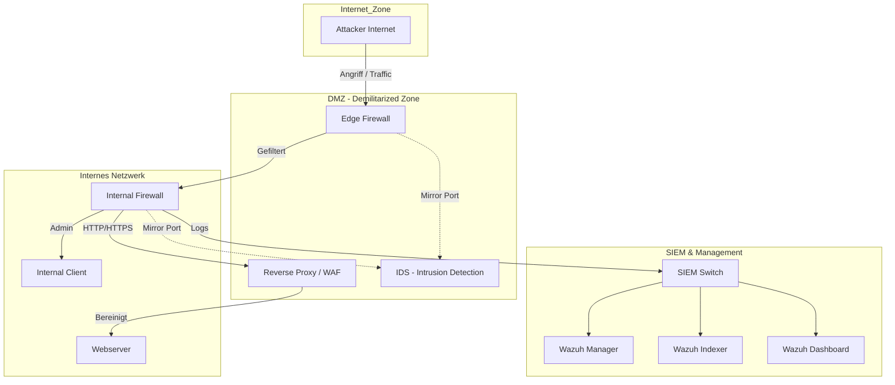
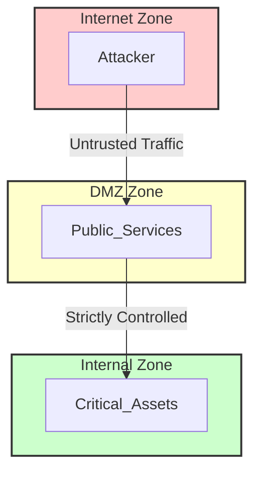
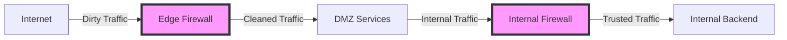
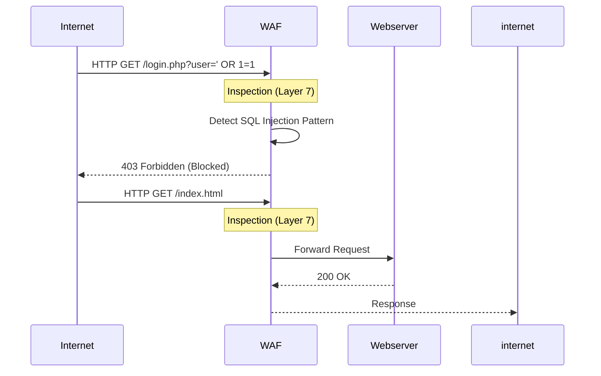
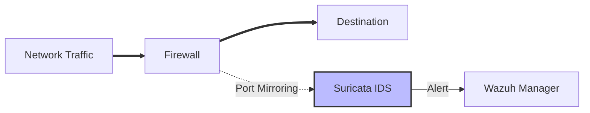
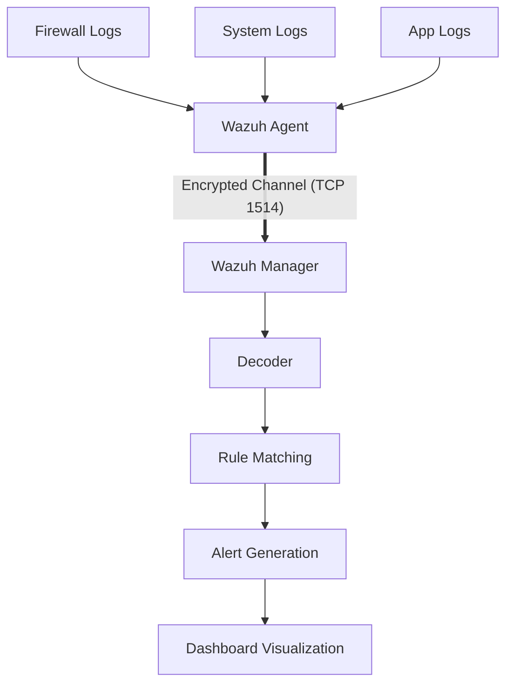
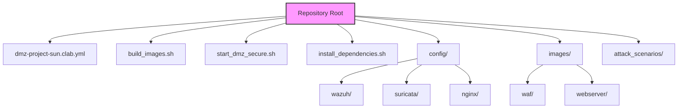

# DMZ-Projekt: Multi-Layer Security Containerlab-basierte Netzwerksimulation

Autor: Jonas Thiel, Nico Nasuti

Kurs: TIS23

## 1. Einleitung

### 1.1 Projektüberblick
Dieses Projekt realisiert eine umfassende und vollständig virtualisierte Laborumgebung zur Simulation einer professionellen Demilitarized Zone (DMZ). Es dient als praxisnahe Plattform ("Cyber Range"), um komplexe Netzwerksicherheitsarchitekturen zu entwerfen, zu implementieren und unter realistischen Bedingungen zu validieren.

Kernstück des Projekts ist die Bereitstellung einer isolierten Testumgebung, die es ermöglicht, Cyber-Angriffe risikofrei zu simulieren und deren Auswirkungen auf die Infrastruktur zu analysieren. Durch den Einsatz von **Containerlab** und **Docker** wird eine hochgradig flexible und reproduzierbare Infrastruktur geschaffen, die typische Unternehmensnetzwerke authentisch nachbildet.

Der Fokus liegt dabei nicht nur auf der Abwehr von Angriffen, sondern vor allem auf der **Sichtbarkeit (Visibility)** und **Erkennung (Detection)** von Sicherheitsvorfällen. Hierfür wird eine robuste Sicherheitsarchitektur implementiert, die aus mehrstufigen Firewalls, einer Web Application Firewall (WAF) und einem Intrusion Detection System (IDS) besteht. Alle Komponenten sind an eine zentrale **Security Information and Event Management (SIEM)** Lösung basierend auf **Wazuh** angebunden. Dies ermöglicht eine zentrale Überwachung und Auswertung aller sicherheitsrelevanten Ereignisse und fördert das Verständnis für das Zusammenspiel verschiedener Sicherheitskomponenten in einem verteilten System.

### 1.2 Einsatzzweck und Zielsetzung
Das primäre Ziel ist die Bereitstellung einer realitätsnahen Laborumgebung zur:
-   **Simulation von Cyber-Angriffen** (z.B. Brute Force, SQL Injection, DDoS).
-   **Analyse von Sicherheitsvorfällen** in Echtzeit.
-   **Validierung von Sicherheitskonfigurationen** (Firewall-Regeln, WAF-Policies).
-   **Demonstration von SIEM-Capabilities** (Log-Aggregation, Korrelation, Alerting).

Die Umgebung dient als praxisnahe Plattform für Security-Audits und Schulungszwecke ("Methodenkompetenz").

### 1.3 Funktionsbeschreibung des Systems
Das System simuliert ein mehrschichtiges Unternehmensnetzwerk, das streng nach Sicherheitszonen segmentiert ist. Der Datenverkehr fließt dabei durch mehrere Kontrollinstanzen, bevor er kritische Dienste erreicht:

1.  **Verkehrsfluss & Filterung**:
    -   Ein externer Akteur (aus dem "Externen Netzwerksegment") initiiert Zugriffsversuche auf Dienste.
    -   Der Verkehr passiert zunächst die **Edge-Firewall**, die als primäre Barriere statische Paketfilterregeln anwendet und den Zugriff auf die DMZ reglementiert.
    -   Innerhalb der DMZ wird HTTP-Verkehr durch einen **Reverse Proxy mit WAF** (Web Application Firewall) geleitet. Dieser analysiert den Inhalt der Anfragen auf Applikationsebene (Layer 7) und blockiert bekannte Angriffsmuster wie SQL-Injections oder Cross-Site Scripting (XSS).
    -   Parallel dazu überwacht ein **Intrusion Detection System (IDS)** den Netzwerkverkehr passiv über einen Mirror-Port, um verdächtige Signaturen zu identifizieren, ohne den Datenfluss zu unterbrechen.
    -   Eine **Interne Firewall** schützt das eigentliche Backend-Netzwerk, in dem sich der Webserver und die Datenbank befinden, vor direkten Zugriffen aus der DMZ.

2.  **Überwachung & Analyse (SIEM)**:
    -   Jede Komponente (Firewalls, Webserver, WAF, IDS) ist mit einem **Wazuh-Agenten** ausgestattet oder sendet Syslogs.
    -   Diese Agenten aggregieren kontinuierlich Logdaten, überwachen die Integrität von Systemdateien (File Integrity Monitoring) und melden Sicherheitsereignisse in Echtzeit an den zentralen **Wazuh-Manager**.
    -   Der Manager korreliert diese Ereignisse, reichert sie mit Threat-Intelligence-Daten an und generiert Alarme, die im **Wazuh Dashboard** visualisiert werden. Dies ermöglicht dem Sicherheitsteam (Blue Team), Angriffe zu rekonstruieren und forensische Analysen durchzuführen.

---

## 2. Entwurf und Methodik

### 2.1 Vorgehensweise bei Entwurf und Umsetzung
Die Umsetzung dieses Projekts folgt einer strikten Trennung zwischen der **Erstellung der Komponenten (Build)** und der **Orchestrierung der Infrastruktur (Run)**. Diese methodische Entscheidung ermöglicht eine saubere Strukturierung und Modularität.

#### Technologische Entscheidungen

1.  **Shell-Skripte & Docker Build für den Build-Prozess**:
    -   Anstelle von Docker Compose verwenden wir dedizierte Shell-Skripte (`build_images.sh`), um die Docker-Images zu erstellen.
    -   **Vorteil**: Dies bietet maximale Kontrolle über den Build-Prozess jeder einzelnen Komponente und vermeidet Abhängigkeiten von externen Orchestrierungstools während der Build-Phase.

2.  **Containerlab für die Netzwerksimulation**:
    -   Containerlab wurde spezifisch für die Orchestrierung von Netzwerklaboren entwickelt und ersetzt hier klassische Docker-Netzwerke.
    -   **Vorteil**: Es erlaubt die Definition von expliziten Netzwerkverbindungen ("Links") zwischen Containern, analog zur physischen Verkabelung zwischen Switches und Servern. Dies ist essenziell, um eine realistische DMZ-Struktur mit mehreren Netzwerkschnittstellen pro Container abzubilden.

3.  **Infrastructure as Code (IaC)**:
    -   Die gesamte Umgebung ist in Code definiert (`.yaml`, `.sh`). Das bedeutet, dass das Labor auf jedem beliebigen Linux-System mit Docker identisch reproduziert werden kann.

### 2.2 Systemarchitektur und Design

#### Netzwerk-Topologie Diagramm
Das folgende Diagramm visualisiert den logischen Aufbau des Netzwerks und den Datenfluss zwischen den Komponenten:



*(Hinweis: Die durchgezogenen Linien zeigen den direkten Datenfluss, gestrichelte Linien symbolisieren gespiegelten Traffic zur Analyse.)*

#### Detaillierte Beschreibung der Komponenten und Interaktionen

Das Diagramm illustriert den Datenfluss und die Sicherheitsmechanismen innerhalb der Infrastruktur. Nachfolgend werden die einzelnen Komponenten, ihre Funktion sowie die Kommunikationswege detailliert beschrieben:

1.  **Attacker Internet (Internet Zone)**
    *   **Funktion**: Emuliert einen externen Bedrohungsakteur.
    *   **Interaktion**: Initiiert Angriffsvektoren (z.B. HTTP-Exploits, Port-Scans, Brute-Force-Attacken) gegen die öffentliche Schnittstelle der `Edge Firewall`.
    *   **Kommunikation**: TCP/IP, diverse Anwendungsprotokolle (HTTP, SSH).

2.  **Edge Firewall (DMZ Zone)**
    *   **Funktion**: Perimeter-Sicherheitsgateway. Sie fungiert als erster Kontrollpunkt für eingehenden Datenverkehr.
    *   **Grund**: Schutz des internen Netzwerks vor direkter Exposition gegenüber dem Internet ("Attack Surface Reduction"). Sie filtert irregulären Traffic (z.B. Scans auf nicht autorisierten Ports) unmittelbar heraus.
    *   **Interaktion**:
        *   Leitet validierten Traffic (z.B. Port 80/443) an die `Internal Firewall` weiter.
        *   Spiegelt den gesamten Datenverkehr über einen **Mirror Port** an das `IDS` zur Analyse.
    *   **Kommunikation**: Routing (Layer 3), Packet Filtering (Layer 4).

3.  **IDS - Intrusion Detection System (DMZ Zone)**
    *   **Funktion**: System zur Angriffserkennung. Analysiert den Netzwerkverkehr passiv auf Basis bekannter Angriffssignaturen.
    *   **Grund**: Ein IDS arbeitet nicht-intrusiv (im Gegensatz zu einem IPS), was das Risiko der Blockierung legitimen Traffics ("False Positives") minimiert. Es dient der reinen Detektion und Alarmierung.
    *   **Interaktion**: Empfängt Duplikate der Datenpakete von den Firewalls. Übermittelt Alarme an den `Wazuh Manager`.
    *   **Kommunikation**: Empfang via Port Mirroring (Promiscuous Mode), Versand von Logs via Syslog/Wazuh-Protokoll an den Manager.

4.  **Internal Firewall (Internes Netzwerk)**
    *   **Funktion**: Interne Segmentierungsfirewall. Sie kontrolliert den Zugriff auf die Backend-Dienste.
    *   **Grund**: Implementierung einer zweiten Verteidigungslinie. Sollte die Edge Firewall kompromittiert oder umgangen werden, schützt diese Instanz die kritischen Assets. Sie erzwingt die Weiterleitung des Traffics durch die WAF vor Erreichen des Webservers.
    *   **Interaktion**:
        *   Leitet HTTP-Traffic an den `Reverse Proxy / WAF`.
        *   Unterbindet direkten Zugriff auf den `Webserver` oder `Client`.
        *   Leitet ebenfalls Traffic-Kopien an das `IDS` weiter.
    *   **Kommunikation**: Routing & Filtering.

5.  **Reverse Proxy / WAF (DMZ Zone)**
    *   **Funktion**: Applikationsschicht-Firewall für den Webserver. Terminiert eingehende Verbindungen, inspiziert den Inhalt (Layer 7) und leitet nur valide Anfragen weiter.
    *   **Grund**: Herkömmliche Firewalls inspizieren keine HTTP-Payloads. Die WAF (ModSecurity) ist in der Lage, Angriffe wie SQL-Injections oder XSS im Datenstrom zu identifizieren, die für eine Paketfilter-Firewall unauffällig erscheinen.
    *   **Interaktion**: Terminiert die Verbindung vom Internet und etabliert eine separate Verbindung zum `Webserver`.
    *   **Kommunikation**: HTTP/HTTPS (Reverse Proxying).

6.  **Webserver (Internes Netzwerk)**
    *   **Funktion**: Der zu schützende Dienst (Asset).
    *   **Interaktion**: Reagiert ausschließlich auf Anfragen, die von der WAF weitergeleitet werden.
    *   **Kommunikation**: HTTP.

7.  **SIEM Stack (Management Zone)**
    *   **Komponenten**: `Wazuh Manager`, `Indexer`, `Dashboard`.
    *   **Funktion**: Zentrale Sicherheitsmanagement-Plattform. Aggregiert Logs von allen Systemkomponenten.
    *   **Grund**: Zentrale Observability ist essenziell für die Sicherheitsanalyse. Ein SIEM ermöglicht die effiziente Auswertung verteilter Logdaten.
    *   **Interaktion**:
        *   **Wazuh Manager**: Empfängt Logs von Agenten oder via Syslog.
        *   **Wazuh Indexer**: Indiziert die Daten in einer durchsuchbaren Datenbank (OpenSearch).
        *   **Wazuh Dashboard**: Visualisiert Sicherheitsvorfälle für Analysten.
    *   **Kommunikation**: Verschlüsselte Übertragung (TCP 1514) zwischen Agent und Manager. REST API für die Kommunikation zwischen Dashboard und Manager.

### 2.3 Sicherheitskonzept

Das Sicherheitskonzept dieses Projekts folgt dem Prinzip der **"Defense in Depth"** (Verteidigung in der Tiefe). Dieser Ansatz basiert auf der Implementierung redundanter Sicherheitsmechanismen auf verschiedenen Ebenen. Sollte ein Sicherheitsmechanismus versagen oder umgangen werden, greifen nachgelagerte Schutzmaßnahmen, um den Angriff zu mitigieren.

Nachfolgend werden die implementierten Maßnahmen und deren sicherheitstechnische Relevanz erläutert:

#### 1. Netzwerksegmentierung (Zonierung)



*   **Konzept**: Logische Unterteilung des Netzwerks in isolierte Sicherheitszonen: Internet, DMZ, Internes Netz und Management-Netz.
*   **Rationale**: Im Falle einer Kompromittierung des Webservers in der DMZ wird der direkte Zugriff auf kritische Backend-Systeme (z.B. Datenbanken) im internen Netz unterbunden. Die Segmentierung begrenzt das Schadensausmaß ("Blast Radius") eines erfolgreichen Angriffs signifikant.

#### 2. Mehrstufiges Firewalling



*   **Konzept**: Einsatz einer zweistufigen Firewall-Architektur (`edge-firewall` und `internal-firewall`).
*   **Rationale**:
    -   Die **Edge-Firewall** filtert unautorisierte Verbindungsversuche und Rauschen bereits am Perimeter. Sie erlaubt ausschließlich Traffic, der für die DMZ-Dienste bestimmt ist.
    -   Die **Interne Firewall** fungiert als finale Sicherheitsbarriere vor den sensiblen Daten. Sie stellt sicher, dass selbst kompromittierte DMZ-Systeme keinen uneingeschränkten Zugriff auf das interne Netzwerk erhalten.

#### 3. Web Application Firewall (WAF)



*   **Konzept**: Einsatz einer spezialisierten Firewall (Nginx mit ModSecurity), welche die HTTP/HTTPS-Kommunikation auf Applikationsebene inspiziert.
*   **Rationale**: Herkömmliche Paketfilter-Firewalls prüfen lediglich Ports und IP-Adressen, besitzen jedoch keine Einsicht in die Nutzdaten. Eine WAF analysiert den Datenstrom inhaltlich. Versucht ein Angreifer beispielsweise, SQL-Befehle (`' OR 1=1 --`) zu injizieren, erkennt die WAF dieses Muster und blockiert die Anfrage, bevor sie den Webserver erreicht.

#### 4. Intrusion Detection System (IDS)



*   **Konzept**: Implementierung eines Detektionssystems (Suricata), welches den Netzwerkverkehr kontinuierlich überwacht.
*   **Rationale**: Firewalls agieren regelbasiert, erkennen jedoch nicht zwangsläufig komplexes Angriffsverhalten innerhalb erlaubter Verbindungen. Das IDS analysiert gespiegelten Datenverkehr auf Signaturen bekannter Malware, Scanner oder Exploits. Es greift nicht aktiv ein, sondern generiert Alarme – eine kritische Komponente für die forensische Analyse und Incident Response.

#### 5. Security Information and Event Management (SIEM) - Wazuh



*   **Konzept**: Zentrale Sicherheitsmanagement-Plattform zur Aggregation und Analyse von Logdaten.
*   **Rationale**:
    -   **Zentralisierung**: In einem Angriffsszenario ist die manuelle Prüfung verteilter Logs ineffizient. Wazuh konsolidiert alle sicherheitsrelevanten Daten an einem zentralen Punkt.
    -   **Korrelation**: Wazuh identifiziert Zusammenhänge zwischen isolierten Ereignissen. Beispiel: "Multiple fehlgeschlagene Logins an der Firewall" korreliert mit "Zugriff auf sensible Systemdatei am Webserver" resultiert in einem hochpriorisierten Alarm. Einzeln betrachtet mögen diese Events unkritisch erscheinen, in Kombination deuten sie auf einen koordinierten Angriff hin.

---

## 3. Installation und Deployment

### 3.0 Repository Struktur & Dateierklärung

Um die Navigation und das Verständnis des Projekts zu erleichtern, wird hier die Struktur des Repositories und die Funktion der zentralen Dateien erläutert.



| Datei / Verzeichnis | Beschreibung |
| :--- | :--- |
| **`dmz-project-sun.clab.yml`** | **Netzwerk-Topologie**: Die zentrale Definitionsdatei für Containerlab. Hier werden alle Nodes (Container), ihre Interfaces, IP-Adressen und die Verbindungen (Links) untereinander definiert. |
| **`build_images.sh`** | **Build-Skript**: Erstellt alle benötigten Docker-Images für die Lab-Umgebung (WAF, IDS, Firewalls, Wazuh-Komponenten). |
| **`start_dmz_secure.sh`** | **Deployment-Skript**: Das Hauptskript zur Steuerung des gesamten Startvorgangs. Es startet die Topologie mit Containerlab, konfiguriert Routing, Firewalls und startet die Wazuh-Dienste. |
| **`install_dependencies.sh`** | **Dependency-Skript**: Installiert notwendige Pakete (z.B. `sshpass`, `nmap`, `curl`) auf den laufenden Containern. |
| **`config/`** | **Konfigurationsdateien**: Enthält Unterordner für die verschiedenen Dienste (z.B. `suricata.yaml`, `nginx.conf`, `wazuh.conf`), die in die Container gemountet werden. |
| **`images/`** | **Dockerfiles**: Quellcode und Dockerfiles für die Erstellung der angepassten Container-Images. |
| **`attack_scenarios/`** | **Angriffssimulation**: Enthält Skripte, um definierte Angriffe (z.B. SSH Brute Force, SQL Injection) gegen die Infrastruktur zu fahren. |

### 3.1 Voraussetzungen
-   **Betriebssystem**: Linux (z.B. Ubuntu/Debian/Kali).
-   **Software**: Docker, Containerlab.
-   **Ressourcen**: Ausreichend RAM (min. 8GB empfohlen) für den ELK/Wazuh-Stack.

### 3.2 Automatisierung und Skripte

Die Installation ist hochgradig automatisiert:

-   **`dmz-project-sun.clab.yml`**: Definiert die Container, Images, Netzwerke und IP-Adressen.
-   **`build_images.sh`**: Baut alle Docker Images lokal.
-   **`start_dmz_secure.sh`**: Das Haupt-Steuerskript.
    1.  Startet die Lab-Umgebung mit `containerlab deploy`.
    2.  Konfiguriert Netzwerk-Routing und Firewalls.
    3.  Konfiguriert und startet den Wazuh-Stack (Manager, Indexer, Dashboard).
    4.  Installiert und registriert Wazuh-Agenten.

### 3.3 Schritt-für-Schritt Installationsanleitung

1.  **Abhängigkeiten installieren**:
    Installieren Sie notwendige Tools auf den Containern:
    ```bash
    sudo bash install_dependencies.sh
    ```

2.  **Images bauen wenn noetig**:
    Bevor das Lab gestartet werden kann, müssen die Docker-Images erstellt werden:
    ```bash
    sudo bash build_images.sh
    ```

2.  **Deployment starten**:
    Führen Sie das Deployment-Skript mit Root-Rechten aus, um die Umgebung zu starten und zu konfigurieren:
    ```bash
    sudo bash start_dmz_secure.sh
    ```
    *Das Skript startet die Containerlab-Topologie, richtet das Netzwerk ein und verbindet alle Agenten mit dem Wazuh Manager.*

4.  **Zugriff auf das Dashboard**:
    Öffnen Sie im Browser `https://localhost:8443` (oder die IP der VM).
    -   **User**: admin
    -   **Password**: SecretPassword123!

5.  **Angriffe starten**:
    Führen Sie die Angriffe mit Root-Rechten aus:
    ```bash
    sudo bash attack_scenarios/run_all_attacks.sh
    ```

---

## 4. Tests und Nachweise

### 4.1 Teststrategie und Integrationsvorgehen
Die Validierung erfolgt in zwei Phasen:
1.  **Connectivity Tests**: Ping und Traceroute zwischen den Zonen, um Routing und Firewall-Basics zu prüfen.
2.  **Attack Simulation**: Gezielte Angriffe mittels der Skripte im Ordner `attack_scenarios/`, um die Detektionsrate des SIEM zu testen.

### 4.2 Funktionsnachweis
Nach erfolgreichem Deployment zeigt `sudo containerlab inspect --name dmz-project-sun` alle Nodes im Status "running".
Logs können in den Containern eingesehen werden:
```bash
docker logs clab-dmz-project-sun-wazuh-manager
```

### 4.3 Wirksamkeitsprüfung der Sicherheitsmaßnahmen

Führen Sie die Angriffssimulationen aus:
```bash
# Einzelner Angriff
sudo bash attack_scenarios/03_web_attacks.sh

# Alle Angriffe
sudo bash attack_scenarios/run_all_attacks.sh
```

**Erwartete Ergebnisse im Wazuh Dashboard:**
1.  **SSH Brute Force**: Alerts der Gruppe `authentication_failed` oder `sshd` (Level > 5).
2.  **Web-Angriffe**: Alerts von der WAF oder Webserver-Logs, die 403/404 Fehler oder ModSecurity-Blockaden anzeigen (z.B. "XSS Blocked", "SQL Injection").
3.  **Port Scans**: Erkennung durch IDS oder Firewall-Logs.

*Screenshots dieser Alerts dienen als Nachweis der Funktionalität.*

---

## 5. Fazit und Ausblick

Das Projekt demonstriert erfolgreich den Aufbau einer sicheren, überwachten IT-Infrastruktur mittels moderner Container-Technologie. Die Kombination aus präventiven Maßnahmen (Firewalls, WAF) und detektiven Maßnahmen (SIEM, IDS) bietet einen umfassenden Schutz.

**Ausblick**:
-   Integration automatischer Gegenmaßnahmen (Active Response), z.B. IP-Blocking bei erkanntem Brute Force.
-   Erweiterung um weitere Dienste (Mailserver, DNS) in der DMZ.
-   Visualisierung der Angriffsvektoren in Kibana/OpenSearch Dashboards.

---

## 6. Verzeichnisse

### 6.1 Erläuterung der verwendeten Hilfsmittel
-   **Containerlab**: Orchestrierungstool für Netzwerklabore.
-   **Docker**: Container-Laufzeitumgebung.
-   **Wazuh**: Open Source SIEM und XDR Plattform.
-   **Nginx + ModSecurity**: Webserver und WAF.
-   **Suricata**: Intrusion Detection.
-   **Google Gemini**: AI-Chatbot

### 6.2 Literatur- und Quellenverzeichnis
-   [Containerlab Dokumentation](https://containerlab.dev/)
-   [Wazuh Dokumentation](https://documentation.wazuh.com/)
-   [OWASP ModSecurity Core Rule Set](https://owasp.org/www-project-modsecurity-core-rule-set/).